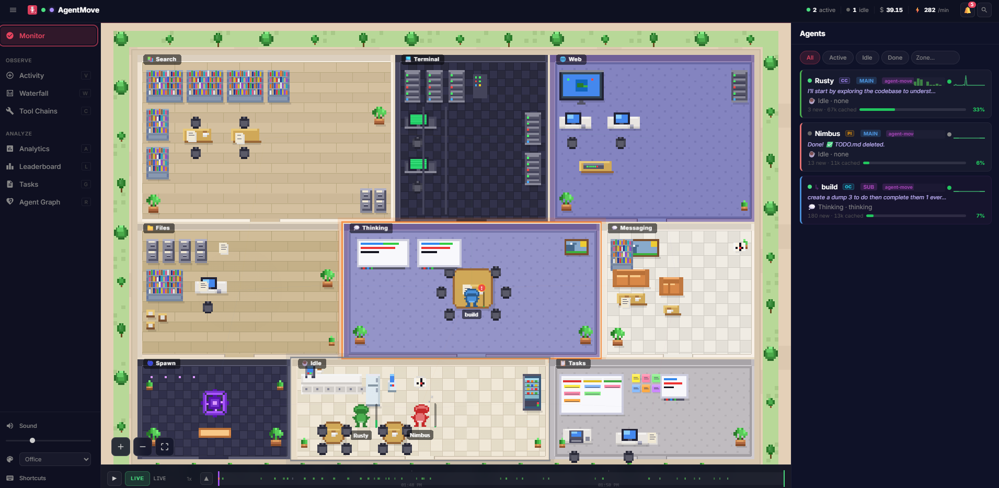

<div align="center">

# AgentMove

**Watch your AI coding agents come alive.**

A real-time pixel-art visualizer that turns AI coding sessions into a living 2D world. Agents walk between rooms, use tools, chat, and rest — all rendered at 60fps in your browser.

```
npx @foothill/agent-move@latest
```

<br>



<br>
<br>

[](https://www.npmjs.com/package/@foothill/agent-move)
[](LICENSE)

</div>

---

## What You're Looking At

AgentMove reads AI coding agent session files and maps every tool call to one of **9 activity zones**. Each agent gets a unique pixel-art character that physically walks between zones as it works.

It uses a **hybrid data pipeline** — JSONL file watching for rich data (tokens, costs, full text) combined with Claude Code hooks for precise lifecycle events (session start/end, tool success/failure, permissions).

| Zone | What Happens There | Tools |
|------|--------------------|-------|
| **Files** | Reading, writing, editing code | Read, Write, Edit, Glob |
| **Terminal** | Running shell commands | Bash |
| **Search** | Searching code and the web | Grep, WebSearch |
| **Web** | Browsing, fetching, MCP tools | WebFetch, Playwright, MCP `*` |
| **Thinking** | Planning and asking questions | EnterPlanMode, AskUserQuestion |
| **Messaging** | Talking to other agents | SendMessage |
| **Tasks** | Managing work items | TaskCreate, TaskUpdate |
| **Spawn** | Agents arriving and departing | Agent, TeamCreate |
| **Idle** | Resting after inactivity | — |

## Getting Started

### Prerequisites

- **Node.js 18+**
- **Claude Code** installed and used at least once (so `~/.claude/` exists)
- Works on **Windows**, **macOS**, and **Linux**

### One Command

```bash
npx @foothill/agent-move@latest
```

That's it. The server starts, hooks are auto-installed, your browser opens, and any active coding session is visualized immediately.

On first run, AgentMove automatically:
1. Installs Claude Code hooks into `~/.claude/settings.json` (17 event types)
2. Creates a hook script at `~/.agent-move/hooks/hook-sender.js`
3. Starts the server and opens your browser

### Options

```bash
npx @foothill/agent-move@latest --port 4000    # custom port (default: 3333)
npx @foothill/agent-move@latest --no-open      # don't auto-open the browser
npx @foothill/agent-move@latest --help         # show all options
```

### Hooks Management

Hooks are auto-installed on first run. You can also manage them manually:

```bash
npx @foothill/agent-move@latest hooks status      # check if hooks are installed
npx @foothill/agent-move@latest hooks install     # (re)install hooks
npx @foothill/agent-move@latest hooks uninstall   # remove hooks
```

AgentMove works without hooks too — it falls back to JSONL file watching. Hooks add precise session lifecycle, tool success/failure tracking, and permission management.

### From Source (for development)

```bash
git clone https://github.com/FoothillSolutions/agent-move.git
cd agent-move
npm install
npm run dev
```

This starts the server on `:3333` and the Vite dev server on `:5173` with hot reload.

## Features

### Hooks Integration

- **Auto-install** — hooks are set up on first run, no manual config needed
- **17 event types** — SessionStart, SessionEnd, PreToolUse, PostToolUse, PermissionRequest, SubagentStart, and more
- **Precise lifecycle** — exact session start/end instead of timeout guessing
- **Tool outcomes** — see green (success) vs red (failure) on completed tool calls
- **Permission management** — approve/deny tool permissions from the visualization UI
- **Notification dashboard** — priority-based feed of permissions, failures, idle alerts
- **Graceful fallback** — everything works without hooks via JSONL watching

### Visualization

- **Programmatic pixel-art sprites** — 16x16 characters rendered at 3x scale, no external image assets
- **12 color palettes** — each agent gets a distinct look
- **6 sprite variants** — Human, Robot, Wizard, Ninja, Skeleton, Slime
- **Animations** — idle breathing, walking between zones, working effects
- **Role badges** — MAIN, SUB, LEAD, MEMBER based on session type
- **Speech bubbles** — show the current tool or text output above each agent
- **Relationship lines** — dashed connections between parent/child and team agents
- **Zone glow** — rooms light up when agents are inside
- **Particle effects** — sparkles on tool use
- **Agent trails** — toggle fading trail dots behind moving agents (`T`)
- **Day/night cycle** — ambient lighting based on your local time (`N`)
- **4 themes** — Office, Space, Castle, Cyberpunk — selectable from the top bar
- **Glassmorphism UI** — modern bento-grid layout with flow lines

### Dashboard

- **Sidebar navigation** — collapsible sidebar with section navigation
- **Top bar** — live stats (active agents, idle count, total cost, token velocity), and quick actions
- **Agent list** — live sidebar with zone, current tool, token counts, and status indicators
- **Agent detail panel** — click any agent to see model, role, tokens, uptime, git branch, recent files with diff viewer, and scrolling activity feed
- **Agent customization** — rename agents and change their color palette (persisted in localStorage)
- **Minimap** — clickable overview showing zone layout, agent positions, and viewport (`` ` ``)
- **Activity feed** — scrollable event log with timestamps and filtering
- **Waterfall view** — Chrome DevTools-style timeline showing tool durations per agent
- **Relationship graph** — interactive force-directed graph of agent parent/child/teammate connections

### Analytics

- **Total cost tracking** — real-time cost estimation including cache read/creation token pricing
- **Cache efficiency** — cache hit rate percentage and estimated savings
- **Token velocity** — tokens/min with sparkline chart and trend indicator
- **Cost by agent** — per-agent cost breakdown with bar charts
- **Time by zone** — cumulative time distribution across zones (including idle)
- **Tool usage** — frequency breakdown of the most-used tools
- **Session duration** — per-agent uptime with active/idle status
- **Cost threshold alerts** — configurable budget alert with visual notification

### Leaderboard

- **Agent rankings** — sortable by tokens, cost, duration, or tool count
- **Medal badges** — top 3 agents highlighted
- **Visual bars** — proportional token usage comparison

### Navigation & Controls

- **Pan & zoom** — scroll wheel to zoom, click and drag to pan the world
- **Command palette** — fuzzy search for any action (`Ctrl+K`)
- **Focus mode** — follow an agent with smooth camera tracking (`F` to cycle, `Esc` to exit)
- **Timeline** — scrubber with live/replay modes, speed control (0.5x–8x), event filters, and per-agent swim lanes
- **Session export** — generate a markdown report of the session (`E`)
- **Sound effects** — synthesized audio for spawn, zone changes, tool use, idle, and shutdown (`M` to mute)
- **Toast notifications** — popup alerts for agent lifecycle events (spawn, idle, shutdown)
- **Keyboard shortcuts** — press `?` to see all available shortcuts
- **Auto-reconnect** — WebSocket reconnects with exponential backoff if the connection drops

## How It Works

```
                    ┌─────────────────┐
Hook events ──────→ │                 │
  (17 types,        │  AgentState     │
   push-based)      │  Manager        │──→ Broadcaster ──→ WebSocket ──→ Client
                    │                 │
JSONL watching ───→ │  (merged state) │
  (byte-offset,     └─────────────────┘
   pull-based)
```

Hook events provide **lifecycle accuracy** (exact session start/end, tool success/failure).
JSONL parsing provides **rich data** (token counts, costs, full response text).

## Architecture

Three-package monorepo (npm workspaces):

```
agent-move/
├── bin/cli.js              # npx entry point (auto-installs hooks)
├── packages/
│   ├── shared/             # Types & constants (zero dependencies)
│   │   └── src/
│   │       ├── types/          AgentState, HookEvent, ServerMessage, ZoneConfig
│   │       └── constants/      tool→zone map, zone configs, color palettes
│   ├── server/             # Fastify backend
│   │   └── src/
│   │       ├── hooks/          hook event manager, hook installer
│   │       ├── watcher/        chokidar file watcher, JSONL parser
│   │       ├── state/          agent state machine, anomaly detector, tool chains
│   │       ├── ws/             WebSocket broadcaster
│   │       └── routes/         REST API
│   └── client/             # Pixi.js frontend
│       └── src/
│           ├── sprites/        pixel-art data, palette resolver, sprite variants
│           ├── world/          zone renderer, grid, camera, themes, layout engine
│           ├── agents/         sprite logic, movement, relationships
│           ├── effects/        particles, zone glow, agent trails, flow lines
│           ├── connection/     WebSocket client, state store
│           ├── audio/          sound effects, notifications
│           └── ui/             sidebar, panels, overlays, waterfall, activity feed
```

## Keyboard Shortcuts

| Key | Action |
|-----|--------|
| `Ctrl+K` | Command palette |
| `?` | Shortcuts help |
| `F` | Cycle focus between agents |
| `Esc` | Exit focus mode |
| `A` | Toggle analytics |
| `L` | Toggle leaderboard |
| `T` | Toggle agent trails |
| `N` | Toggle day/night cycle |
| `M` | Toggle sound |
| `E` | Export session |
| `` ` `` | Toggle minimap |
| `P` | Cycle theme |
| `H` | Toggle heatmap |

## API

| Endpoint | Description |
|----------|-------------|
| `GET /api/health` | Health check |
| `GET /api/state` | All agent states as JSON |
| `POST /hook` | Claude Code hook event receiver |
| `WS /ws` | Real-time agent event stream |

The WebSocket sends a `full_state` snapshot on connect, then incremental events: `agent:spawn`, `agent:update`, `agent:idle`, `agent:shutdown`, `permission:request`, `hooks:status`.

## Troubleshooting

| Problem | Solution |
|---------|----------|
| Port already in use | `npx @foothill/agent-move@latest --port 4444` |
| Hooks not working | `npx @foothill/agent-move@latest hooks status` to check, then `hooks install` to fix |
| No agents showing up | Make sure Claude Code is running — agents appear when sessions are active |
| Build artifacts missing (from source) | Run `npm run build` |
| Permission denied on port | Use a port above 1024: `--port 3333` |
| Browser didn't open | Visit `http://localhost:3333` manually, or check `--no-open` flag |

Need more help? [Open an issue](https://github.com/FoothillSolutions/agent-move/issues)

## Tech Stack

| Layer | Technology |
|-------|------------|
| Renderer | [Pixi.js](https://pixijs.com/) v8 (WebGL) |
| Server | [Fastify](https://fastify.dev/) + [@fastify/websocket](https://github.com/fastify/fastify-websocket) |
| File watching | [chokidar](https://github.com/paulmillr/chokidar) v3 |
| Client build | [Vite](https://vite.dev/) |
| Language | TypeScript (strict, ES modules) |

## License

MIT
